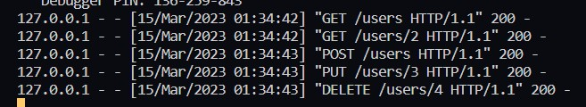
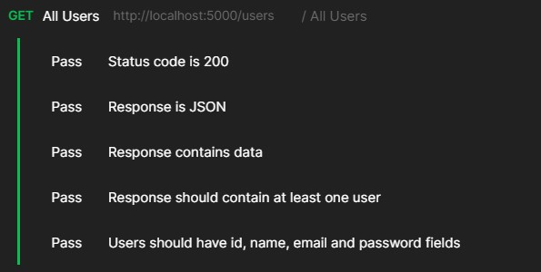
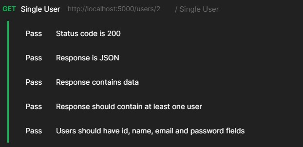
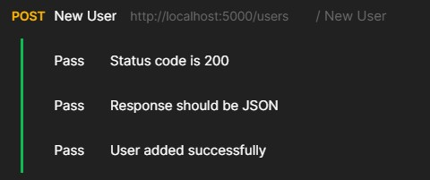
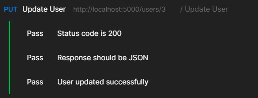
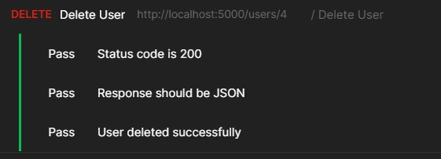

# SDE Intern Assignment

This repository contains a flask application which implements api endpoints for performing crud operations on a mongo database.The flask application provides the following api endpoints.

- GET /users - Returns a list of all users.
- GET /users/`<id>` - Returns the user with the specified ID.
- POST /users - Creates a new user with the specified data.
- PUT /users/`<id>` - Updates the user with the specified ID with the new data.
- DELETE /users/`<id>` - Deletes the user with the specified ID.

## Installation

1. First clone this repository

```bash
git clone https://github.com/Nitesh-13/SDE-Intern-Assignment
```

2. Use the package manager [pip](https://pip.pypa.io/en/stable/) to install the modules necessary for the flask application to run.

```bash
pip install -r /path/to/requirements.txt
```

3. Set the MongoDB URI and database name in the Flask application configuration.
4. Run the Flask application using the flask run command.

## API Requests

- GET /users - Returns a list of all users.

```bash
GET http://localhost:5000/users
```

- GET /users/`<id>` - Returns the user with the specified ID.

```bash
GET http://localhost:5000/users/2
```

- POST /users - Creates a new user with the specified data.

```bash
POST http://localhost:5000/users
Content-Type: application/json

//body
{
    "id": 4,
    "name": "ABC DEF",
    "email": "abc@example.com",
    "password": "password000"
}
```

- PUT /users/`<id>` - Updates the user with the specified ID with the new data.

```bash
PUT http://localhost:5000/users/5
Content-Type: application/json

//body
{
    "name": "DEF Doe",
    "email": "test@mail.com"
}
```

- DELETE /users/`<id>` - Deletes the user with the specified ID.

```bash
DELETE http://localhost:5000/users/4
```

## Results

Requests received through postman.

You can download and import the `Flask_Mongo_API.postman_collection.json` file inside the Postman to test out the api endpoints with different type of results.



All tests passed inside Postman for all endpoints









